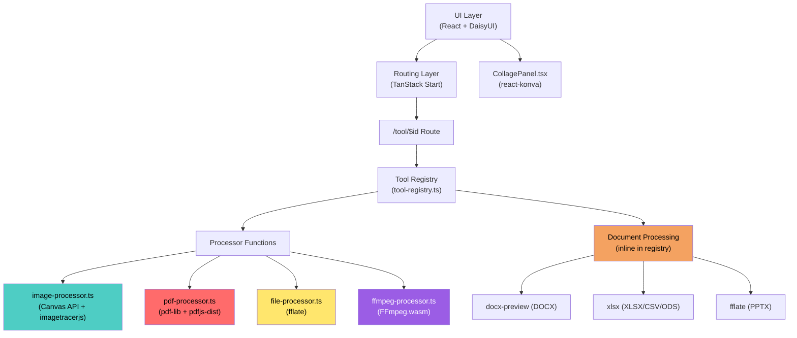
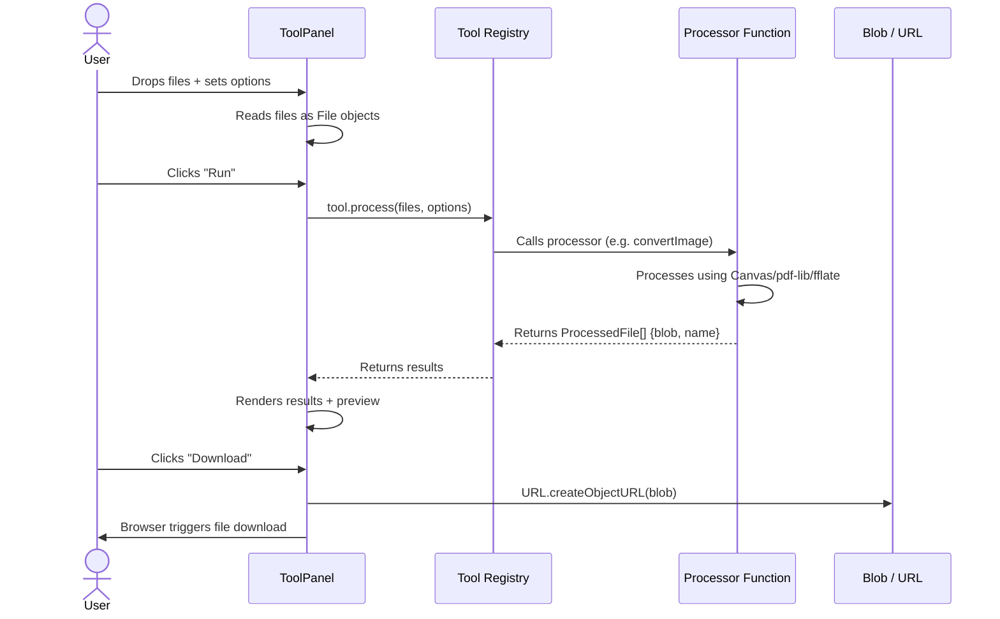
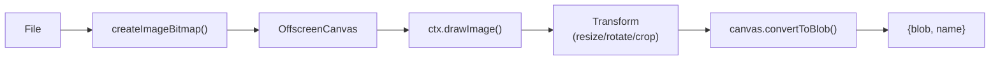
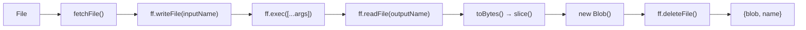
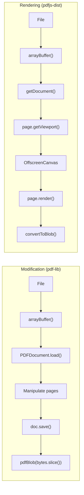
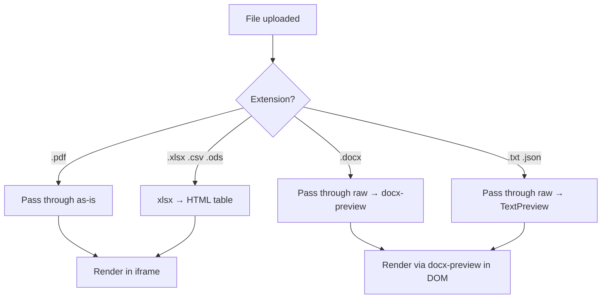
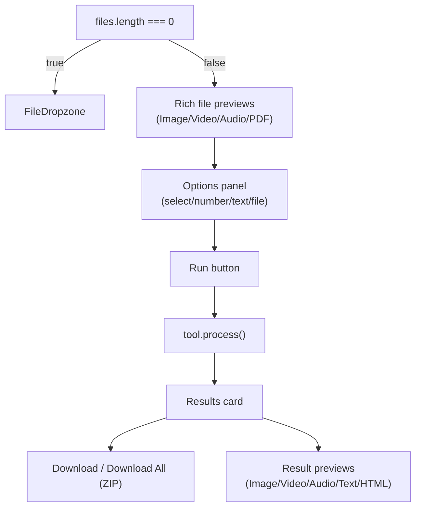

# Hanee

Hanee is a privacy-first, serverless suite of file-processing tools that runs entirely in your browser. All operations are performed locally, ensuring your files remain on your device with no uploads or backend involvement.

Built as a Progressive Web App (PWA), it works offline and provides a modular, extensible platform for handling documents, images, and media through a simple, consistent interface.

> Please leave a star ⭐ to show your support.

---

## Architecture

### Component Overview

---

### Sequence Diagram

---

### WASM Architecture

All heavy media processing operations (Video, Audio, GIF) leverage WebAssembly (WASM) binaries executing strictly within the client sandbox. The application architecture establishes isolated Background Web Workers to prevent completely blocking the main UI JavaScript thread during mathematically intensive transcodings.

* **Virtual File System (VFS)**: When a tool process fires, the native `File` binary object is converted into an `ArrayBuffer` and mounted directly into the FFmpeg WASM internal VFS. The execution runs precisely as an isolated terminal binary (`ff.exec`). 
* **Worker Execution**: The FFmpeg core runs on its own dedicated thread, fetching `ffmpeg-core.wasm` asynchronously upon the first interaction. 
* **Ephemeral Memory Allocation**: As soon as the `outputName` buffer is intercepted from the VFS and cast back into a Blob, all trace targets (temporary `.mp4` payloads etc.) are immediately flushed via `ff.deleteFile()` to drastically preserve memory limitations and bypass manual streaming wipes.
* **Security Constraints**: WASM relies critically upon `SharedArrayBuffer` mapping, mandating server execution with `COOP: same-origin` and `COEP: require-corp` headers.

---

### Component Responsibilities

**UI Layer**
Renders file input, option controls, live preview, progress indicators, and download buttons. All UI components are built with DaisyUI. The UI layer does not perform any file processing; it calls the tool's `process` function and displays results.

**Routing Layer**
Maps URL routes to tool IDs using TanStack Start. The route `/tool/$id` is a single generic route; there are no per-tool route files. The tool ID from the URL is used to look up the tool definition in the Tool Registry.

**Tool Registry** (`src/lib/tool-registry.ts`)
A static array of tool definitions. Each tool specifies its ID, name, category, accepted file types, UI options, and a `process` function. The `process` function takes `(files: File[], options)` and returns `ProcessedFile[]`; an array of `{blob, name}` objects. This design means adding a new tool is a single object in one file.

**Processor Functions** (`src/lib/*-processor.ts`)
Stateless async functions that perform the actual file processing:

* `image-processor.ts`; uses the Canvas API (`OffscreenCanvas`) for **Convert**, **Resize**, **Compress**, **Rotate**, **Crop**, **Upscale**, **Blur**, **Pixelate**, and **Watermark** (Text Overlay), and `imagetracerjs` for raster-to-SVG vectorization.
* `pdf-processor.ts`; uses `pdf-lib` for **Merge**, **Split**, **Delete Pages**, **Reorder**, **Images to PDF**, **Compress**, **Watermark**, and **Rotate**, and `pdfjs-dist` for rendering/text extraction.
* `file-processor.ts`; uses `fflate` for **ZIP creation** and **Extraction**, and native handlers for **CSV ↔ JSON** conversion and **JSON Formatting**.
* `ffmpeg-processor.ts`; uses `@ffmpeg/ffmpeg` for Video/Audio **Convert**, **Trim**, **Merge**, **Mute**, **Speed**, **Resize**, **Crop**, **Watermark**, and **Frame Extraction**.
* Document processing (DOCX via `docx-preview` in UI, XLSX/CSV/ODS via `xlsx`, TXT/JSON inline) is implemented within `tool-registry.ts`.
* `CollagePanel.tsx`; uses `react-konva` for drag/resize/layer image collage with WASD movement and PNG/JPG export.

---

### Data Flow

When a user drops files and clicks run:

1. The `ToolPanel` component reads the tool definition from the registry via the route's `$id` param.
2. Files are stored as standard `File` objects (no `ArrayBuffer` conversion needed).
3. When the user clicks "Run", `ToolPanel` calls `tool.process(files, options)`.
4. The processor function (e.g. `convertImage`) processes each file and returns `ProcessedFile[]`.
5. Results are rendered in the UI with file sizes, previews (for images), and a "Download" button.
6. On download, `URL.createObjectURL(blob)` creates a temporary URL and a hidden `<a>` element triggers the browser's native download.

---

### Batch Processing

When multiple files are submitted, the `batch()` helper iterates over each file sequentially calling the processor function. For tools like PDF merge, all files are processed as a single batch. Results are collected into an array and displayed together with individual and "Download All" (ZIP) buttons.

---

### Image Processing Pipeline

All 6 image functions follow this exact pipeline. The `mimeToExt()` helper maps MIME types to file extensions. Quality parameter (0-1) is passed to `convertToBlob()` for lossy formats.

---

### FFmpeg WASM Pipeline

The `getFFmpeg()` singleton ensures the WASM core is loaded only once. `toBytes()` converts the VFS output to a fresh `ArrayBuffer`-backed `Uint8Array` for TS6 `BlobPart` compatibility. All temporary files are immediately deleted after reading.

---

### PDF Processing Pipeline

`pdfBlob()` helper applies `.slice()` to convert `Uint8Array<ArrayBufferLike>` to a clean `BlobPart`. All PDF loads use `{ ignoreEncryption: true }`.

---

### Document Viewer Routing

Document viewer auto-processes on file drop (no "Run" button needed). Results render in a sandboxed `<iframe>` or inline codeblocks.

---

### ToolPanel Rendering Flow

Special tool UIs: `image-crop` shows drag-to-crop overlay, `image-rotate` shows before/after, `pdf-delete-pages` and `pdf-reorder` show all-pages grid with page controls, `image-collage` renders `CollagePanel` with react-konva.

---

## PWA & Offline

Serwist is configured in `vite.config.ts` to precache all build output using `globPatterns: ['**/*']`. This includes HTML, JS, CSS, WASM binaries, and worker scripts. After the first load, the application and all WASM modules are available offline. There is no custom service worker logic; do not add any.

User files are never cached. All processing is in-memory and ephemeral.

---

## Performance Strategy

* Image processing uses the browser's native Canvas API; no WASM overhead for basic operations
* PDF operations use pdf-lib which is pure JavaScript; fast for document manipulation
* ZIP compression uses fflate which is optimized for browser environments
* File data stays as native `File` / `Blob` objects; no unnecessary `ArrayBuffer` conversions
* The initial JS bundle is kept minimal; processor modules are tree-shaken by Vite
* FFmpeg.wasm automatically manages its own internal Web Worker, avoiding main-thread blocking for heavy media processing

---

## Limitations

* Large files may hit browser memory limits; there is no streaming to disk
* Some advanced conversions require codecs not available in WASM builds
* Safari has limited WASM thread support; single-threaded fallback may be required

---

## Agent Guidelines

> This project is vibecoded with Antigravity. Which shouldn't be a problem since it is sandboxed by the browser and nothing leaves the machine.

### Environment

* Use `nix-shell` to access `node` (v24+) and `npm`. All commands must be run inside `nix-shell` or prefixed with `nix-shell --run "..."` .
* After `npm install`, the `postinstall` script copies FFmpeg WASM files to `public/ffmpeg/`.
* The dev server runs on port 3000: `nix-shell --run "npm run dev"`
* Production build: `nix-shell --run "npm run build"` then preview with `nix-shell --run "npm run preview"`

### Development Rules

* **README accuracy**: Update this README with every change. Keep architecture diagrams accurate.
* **Browser testing**: Test on the **production build** (`npm run preview`), for all tools end to end. The COOP/COEP headers and service worker behavior differ.
* **DaisyUI only**: All UI must use DaisyUI component classes. Raw Tailwind only for layout (flex, grid, gap, padding, margin). No custom CSS files.
* **Tool Registry pattern**: Tools live as objects in `tool-registry.ts`. Each has a `process(files, options) → ProcessedFile[]` function. Do not create per-tool route files or per-tool components.
* **Processor pattern**: Processor functions are stateless async in `src/lib/*-processor.ts`. Use `batch()` helper for multi-file iteration.
* **File objects**: Keep data as native `File` / `Blob`. Only convert to `ArrayBuffer` when a library demands it.
* **No backend**: No server routes, API calls, or backend deps. Everything is client-side.
* **No custom SW**: Serwist handles offline caching. Never add custom service worker logic.
* **Tests**: Run `nix-shell --run "npx vitest run"` — all must pass. Add tests for new tools/processors.
* **Linting**: Run `nix-shell --run "npx biome check"` — must pass. Auto-fix with `npx biome check --write`.
* **Build**: Run `nix-shell --run "npm run build"` — must succeed before considering work done.

### How to Add a New Tool

1. If the tool needs a new processing function, add it to the appropriate `*-processor.ts` file (or create a new one if it's a new domain).
2. Add a tool definition object to the `tools` array in `tool-registry.ts` with: `id`, `name`, `description`, `category`, `icon`, `acceptedExtensions`, `multiple`, `options`, and `process` function.
3. The tool will automatically appear on the homepage and be routable at `/tool/{id}`.
4. Add a test in `tests/lib/` verifying the processor function.

### Common Pitfalls

* `Uint8Array<ArrayBufferLike>` from pdf-lib/fflate is not a valid `BlobPart` in TS6. Always `.slice()` before wrapping in `new Blob()`.
* FFmpeg.wasm requires `SharedArrayBuffer`, which needs COOP/COEP headers. These are set in `vite.config.ts` and `vercel.json`, similarly needed to be handled by other hosting providers.
* The `acceptedExtensions` array must contain only strings starting with `.` or the wildcard `*`. MIME types go in `FileDropzone`'s accept attribute logic, not here.
* Document viewer auto-triggers on file drop (no Run button). This is handled by the `useEffect` in `ToolPanel` that watches `tool.id === 'document-viewer'`.
* biome enforces tab indentation, double quotes, and no semicolons. Run `npx biome check --write` to auto-fix.
