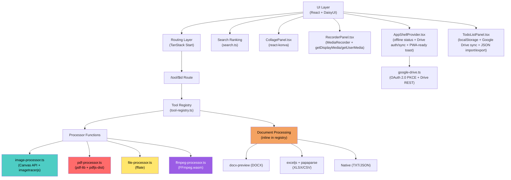
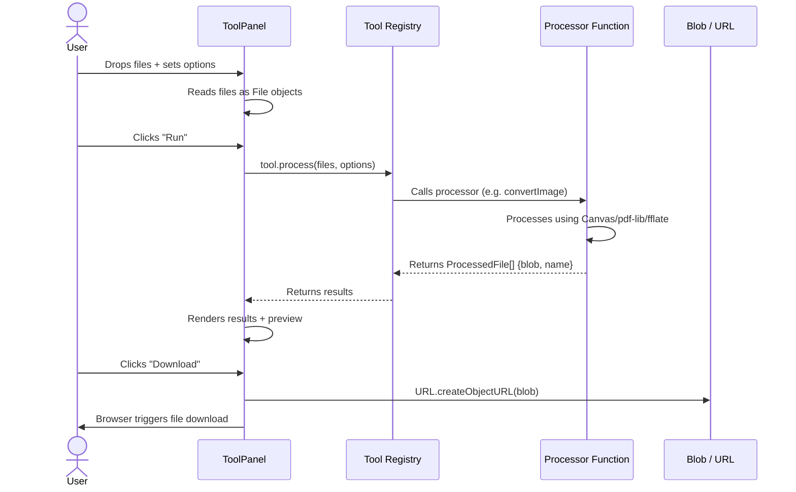
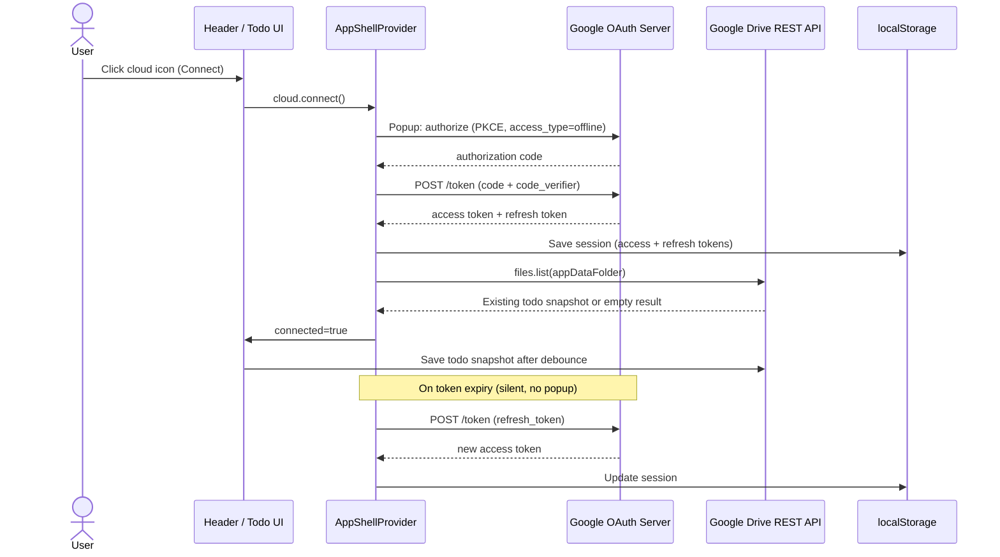
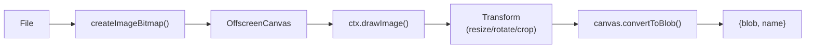
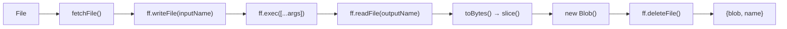
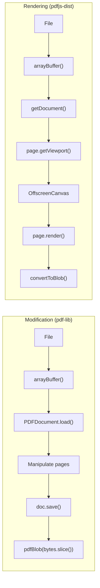
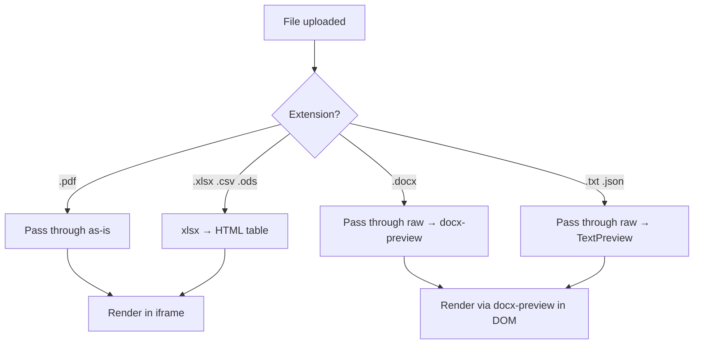
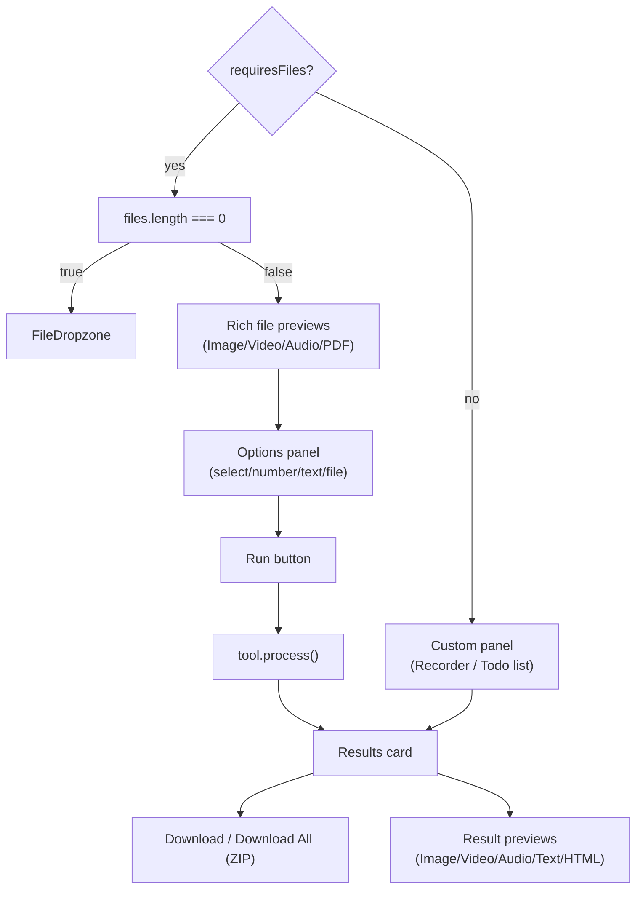

# Kitsy

Kitsy is a backendless, local-first toolbox for everyday file, media, document, recorder, and todo workflows. It runs in the browser, can be installed as an offline PWA, keeps file processing on the user's device, and does not require a Kitsy-owned server. Optional Google Drive support lets users auto-sync the todo list into their own hidden Drive app data and save processed outputs into their own Drive, while the app still works fully local-only when cloud is disconnected or unavailable.

> Please consider leaving a star ⭐

> [!WARNING]
> **Browser Extension Risk:** Disable all browser extensions for Kitsy, especially when connected to the cloud. Extensions with broad permissions can bypass security policies and access your Google Drive refresh token stored in `localStorage`.

https://github.com/user-attachments/assets/f9865175-f371-4a42-a2d9-6563e7e64c68

---

## Architecture

### Component Overview



---

### Sequence Diagram



---

### WASM Architecture

All heavy media processing operations (Video, Audio, GIF) leverage WebAssembly (WASM) binaries executing strictly within the client sandbox. The application architecture establishes isolated Background Web Workers to prevent completely blocking the main UI JavaScript thread during mathematically intensive transcodings.

- **Virtual File System (VFS)**: When a tool process fires, the native `File` binary object is converted into an `ArrayBuffer` and mounted directly into the FFmpeg WASM internal VFS. The execution runs precisely as an isolated terminal binary (`ff.exec`).
- **Worker Execution**: The FFmpeg core runs on its own dedicated thread, fetching `ffmpeg-core.wasm` asynchronously upon the first interaction.
- **Ephemeral Memory Allocation**: As soon as the `outputName` buffer is intercepted from the VFS and cast back into a Blob, all trace targets (temporary `.mp4` payloads etc.) are immediately flushed via `ff.deleteFile()` to drastically preserve memory limitations and bypass manual streaming wipes.
- **Security headers**: Vite dev, Vite preview, and Nitro responses set `COEP: require-corp` and `CORP: same-origin`. `COOP` is intentionally `same-origin-allow-popups` so the OAuth consent popup can communicate back to the opener window during the initial Drive authorization. After the first consent, session renewal uses a direct `fetch` to the token endpoint with a stored refresh token — no popup needed. This is a deliberate compromise: the current `@ffmpeg/core` worker flow remains usable, but a future move to a strict `SharedArrayBuffer`/multi-thread FFmpeg build would need either route-level isolation for media tools or a redirect-based auth flow instead of the popup consent flow.

---

### Component Responsibilities

**UI Layer**
Renders file input, option controls, live preview, progress indicators, download buttons, Drive upload buttons, the offline indicator, and the offline-ready notification. All UI components are built with DaisyUI. The UI layer does not perform any file processing; it calls the tool's `process` function and displays results.

**Routing Layer**
Maps URL routes to tool IDs using TanStack Start. The route `/tool/$id` is a single generic route; there are no per-tool route files. The tool ID from the URL is used to look up the tool definition in the Tool Registry.

**App Shell Provider** (`src/components/AppShellProvider.tsx`)
Tracks `navigator.onLine`, prefetches FFmpeg plus the service worker, surfaces the offline-ready toast, and owns the optional Google Drive session. The session includes a long-lived refresh token stored in `localStorage`. On page load, if a refresh token exists, the provider silently exchanges it for a new access token via `POST https://oauth2.googleapis.com/token` — no popup or user interaction needed. A proactive timer refreshes the access token 2 minutes before expiry. A reconnect hint in `localStorage` triggers automatic silent reconnect on reload when a previous session existed. Popups only appear on explicit user-initiated "Connect Drive" clicks.

**Tool Registry** (`src/lib/tool-registry.ts`)
A static array of tool definitions. Each tool specifies its ID, name, category, accepted file types, UI options, UI mode, search metadata, and a `process` function. The `process` function takes `(files: File[], options)` and returns `ProcessedFile[]`; an array of `{blob, name}` objects. Tools that do not need uploaded files, such as recorders and the todo list, declare `requiresFiles: false` and a custom `uiMode` while still remaining discoverable through the same registry.

**Google Drive Client** (`src/lib/google-drive.ts`)
Implements a manual OAuth 2.0 Authorization Code flow with PKCE (no external script dependency). On first "Connect Drive", a popup opens to `accounts.google.com` with `access_type=offline` and `prompt=consent`. The returned authorization code is exchanged for an access token and a long-lived refresh token via a direct `fetch` to `https://oauth2.googleapis.com/token`. Subsequent session renewals use the refresh token — no popup, no GIS script, no user interaction. The module requests the non-sensitive `drive.file` and `drive.appdata` scopes, writes todo snapshots to the hidden `appDataFolder`, and uploads processed results to a visible `Kitsy` folder. The consent popup depends on `Cross-Origin-Opener-Policy: same-origin-allow-popups`; strict `same-origin` prevents the popup from communicating the auth code back to the opener.

**Processor Functions** (`src/lib/*-processor.ts`)
Stateless async functions that perform the actual file processing:

- `image-processor.ts`; uses the Canvas API (`OffscreenCanvas`) for **Convert**, **Resize**, **Compress**, **Rotate**, **Crop**, **Upscale**, **Blur**, **Pixelate**, and **Watermark** (Text Overlay), and `imagetracerjs` for raster-to-SVG vectorization.
- `pdf-processor.ts`; uses `pdf-lib` for **Merge**, **Split**, **Delete Pages**, **Reorder**, **Images to PDF**, **Compress**, **Watermark**, **Rotate**, **Add Page Numbers**, **Flatten Forms**, and **Edit Metadata**, and `pdfjs-dist` for rendering/text extraction.
- `file-processor.ts`; uses `fflate` for **ZIP creation** and **Extraction**, `papaparse` for **CSV ↔ JSON** conversion, and native handlers for **JSON Formatting**.
- `ffmpeg-processor.ts`; uses `@ffmpeg/ffmpeg` for Video/Audio **Convert**, **Trim**, **Merge**, **Mute**, **Volume**, **Fade**, **Speed**, **Resize**, **Crop**, **Watermark**, and **Frame Extraction**.
- Document processing (DOCX via `docx-preview` in UI, XLSX via `exceljs`, CSV via `papaparse`, TXT/JSON inline) is implemented within `tool-registry.ts`.
- `CollagePanel.tsx`; uses `react-konva` for drag/resize/layer image collage with WASD movement and PNG/JPG export.
- `RecorderPanel.tsx`; uses `MediaRecorder`, `navigator.mediaDevices.getUserMedia()`, `navigator.mediaDevices.getDisplayMedia()`, canvas compositing, and optional audio mixing to record screen, camera, and microphone input entirely locally.
- `TodoListPanel.tsx`; uses `localStorage` for primary persistence, fuzzy search, inline autosave, task completion toggling, reminder dates, pinning, JSON import/export, and optional automatic Google Drive sync. Imports and syncs always append/merge into the local list using a timestamp-based resolver instead of replacing data. Supports inline clickable URL rendering and contenteditable plain-text editing. Pin and delete actions are inline in the reminder row for a compact card layout.

---

### Data Flow

When a file-based tool runs:

1. The `ToolPanel` component reads the tool definition from the registry via the route's `$id` param.
2. Files are stored as standard `File` objects (no `ArrayBuffer` conversion needed).
3. When the user clicks "Run", `ToolPanel` calls `tool.process(files, options)`.
4. The processor function (e.g. `convertImage`) processes each file and returns `ProcessedFile[]`.
5. Results are rendered in the UI with file sizes, previews (for images), a "Download" button, and an adjacent "Save to Drive" action when cloud sync is configured.
6. On download, `URL.createObjectURL(blob)` creates a temporary URL and a hidden `<a>` element triggers the browser's native download.
7. On "Save to Drive", the app requests a Google token from the browser popup flow and uploads directly to the user's Drive without proxying through a Kitsy backend.

No-file tools follow the same route-level architecture but keep all state in the browser:

1. `screen-recorder`, `camera-recorder`, and `audio-recorder` render `RecorderPanel`.
2. Capture streams come from browser-native media APIs and never leave the device.
3. Recorded chunks are accumulated in memory, converted to a Blob, and surfaced through the same generic result card used by file processors.
4. `todo-list` renders `TodoListPanel`, persists items in `localStorage`, keeps a blank draft row at the top, renders URLs as inline links in the todo text, switches a clicked todo into a plain-text contenteditable editor, autosaves inline edits, and syncs automatically with Google Drive when the optional cloud session is connected.

Google Drive auth and todo sync flow:



---

### Batch Processing

When multiple files are submitted, the `batch()` helper iterates over each file sequentially calling the processor function. For tools like PDF merge, all files are processed as a single batch. Results are collected into an array and displayed together with individual download/Drive-save buttons plus a "Download All" (ZIP) action.

---

### Image Processing Pipeline



All 8 image functions (Convert, Resize, Rotate, Crop, Upscale, Blur, Pixelate, Watermark) follow this exact pipeline. The `mimeToExt()` helper maps MIME types to file extensions. Quality parameter (0-1) is passed to `convertToBlob()` for lossy formats.

---

### FFmpeg WASM Pipeline



The `getFFmpeg()` singleton ensures the WASM core is loaded only once. `toBytes()` converts the VFS output to a fresh `ArrayBuffer`-backed `Uint8Array` for TS6 `BlobPart` compatibility. All temporary files are immediately deleted after reading.

---

### PDF Processing Pipeline



`pdfBlob()` helper applies `.slice()` to convert `Uint8Array<ArrayBufferLike>` to a clean `BlobPart`. All PDF loads use `{ ignoreEncryption: true }`.

---

### Document Viewer Routing



Document viewer auto-processes on file drop (no "Run" button needed). Results render in a sandboxed `<iframe>` or inline codeblocks.

---

### ToolPanel Rendering Flow



Special tool UIs: `image-crop` shows drag-to-crop overlay, `image-rotate` shows before/after, `pdf-delete-pages` and `pdf-reorder` show all-pages grid with page controls, `image-collage` renders `CollagePanel` with react-konva, recorder tools render `RecorderPanel`, and `todo-list` renders `TodoListPanel`.

---

## 2. PWA & Offline Support

The application uses Vite-PWA with standard Service Workers to ensure the tools can be safely installed as a desktop or mobile application. Once initialized, the full FFmpeg WASM bundle and required visual libraries are durably cached locally, enabling unlimited airplane-mode file processing at peak hardware performance.

New local-first guarantees in this build:

- Recorder tools use browser media APIs only. They do not upload streams or depend on any backend.
- The todo list is persisted in `localStorage`, can sync to Google Drive `appDataFolder`, and still exports/imports plain local JSON without requiring any server round trip.
- Cloud controls are shown as a compact cloud status icon in the header (connected/disconnected/offline states) so the navbar remains uncluttered on small screens.
- The app shows an offline-ready toast once FFmpeg and the service worker cache are ready for installed/PWA usage.
- Search ranking, recorder result assembly, and React Compiler output are all runtime-local and continue to work offline once the app shell has been cached.

---

## Performance Strategy

- Image processing uses the browser's native Canvas API; no WASM overhead for basic operations
- PDF operations use pdf-lib which is pure JavaScript; fast for document manipulation
- ZIP compression uses fflate which is optimized for browser environments
- File data stays as native `File` / `Blob` objects; no unnecessary `ArrayBuffer` conversions
- The initial JS bundle is kept minimal; processor modules are tree-shaken by Vite
- FFmpeg.wasm automatically manages its own internal Web Worker, avoiding main-thread blocking for heavy media processing
- React Compiler is enabled through `@vitejs/plugin-react` with `reactCompiler: true`, so component code should not add manual `useMemo` or `useCallback` for ordinary render optimization. Prefer direct derived values and plain functions; only add a hook when it is needed for behavior, not referential micro-optimization.

---

## Google Drive Setup

Kitsy uses a manual OAuth 2.0 Authorization Code flow with PKCE directly in the browser. There is no Kitsy backend; the authorization code is exchanged for tokens via a direct `fetch` to Google's token endpoint. Both the client ID and optional client secret are embedded as build-time env vars (this is standard for public OAuth clients).

1. Open Google Cloud Console and create or select a project.
2. Enable the Google Drive API for that project.
3. Configure the OAuth consent screen in Google Auth Platform. Set the app name, support email, developer contact, homepage/privacy links for production, and publish or add test users as needed.
4. In Data Access, request these scopes:
   - `https://www.googleapis.com/auth/drive.appdata` for the hidden todo sync document.
   - `https://www.googleapis.com/auth/drive.file` for files/folders Kitsy creates or opens through the app.
5. Create an OAuth Client ID with application type `Web application`.
6. Add Authorized JavaScript origins for every environment that will open Kitsy, for example:
   - `http://localhost:3000`
   - `https://your-production-domain.example`
7. Add Authorized redirect URIs matching the origins (e.g. `http://localhost:3000/`, `https://your-production-domain.example/`).
8. Put the client ID and client secret in local env:
   - `VITE_GOOGLE_DRIVE_CLIENT_ID=...`
   - `VITE_GOOGLE_DRIVE_CLIENT_SECRET=...` (from the OAuth client credentials page)
   The dev script loads `.env.local`, and Vite also reads standard `.env*` files.
9. Keep the response headers from `vite.config.ts` or mirror them on the host:
   - `Cross-Origin-Opener-Policy: same-origin-allow-popups`
   - `Cross-Origin-Embedder-Policy: require-corp`
   - `Cross-Origin-Resource-Policy: same-origin`
10. Start the app, click the cloud icon in the header, grant the two scopes, then verify the icon turns green (connected) and the todo panel reports active Drive sync.

If Google Console origins/redirect URIs are already correct but the app says the authorization popup was closed while the popup is still open, check the COOP header first. Strict `same-origin` prevents the popup from passing the authorization code back to the opener window.

---

## Security, Privacy, and Compromises
- All file processors run locally in the browser. The app does not upload user files to a Kitsy server.
- Google Drive is the only network storage integration. It is optional and disabled while offline.
- Access and refresh tokens are stored in `localStorage` for session persistence across page reloads. Refresh tokens allow the provider to silently obtain new access tokens via `POST https://oauth2.googleapis.com/token` — no popup or user interaction needed. A proactive timer refreshes the access token 2 minutes before expiry. A reconnect hint in `localStorage` triggers automatic silent reconnect on reload.
- Todo sync writes one JSON document named `kitsy.todo-sync.v2.json` into Drive `appDataFolder`. Processed outputs are uploaded only when the user chooses Drive save actions and go into a visible `Kitsy` folder.
- Todo editing uses contenteditable only as a plain-text editor. Paste is forced to `text/plain`, links are rendered by React from sanitized `http`/`https` text segments, and link anchors use `target="_blank"` with `noopener`.
- DOCX preview rendering delegates document HTML to `docx-preview`; error text is inserted with `textContent`, not HTML.
- The OAuth popup compatibility header is a conscious tradeoff. `same-origin-allow-popups` allows the initial consent popup to return the authorization code to the opener. After the first consent, token renewal is purely `fetch`-based and does not need a popup. Strict `same-origin` is stronger for cross-origin isolation but breaks the initial popup flow. If the project later adopts a multi-thread FFmpeg core that strictly requires cross-origin isolation, split media processing into an isolated route/origin or change Drive auth to a redirect model.

## Limitations

- Large files may hit browser memory limits; there is no streaming to disk
- Some advanced conversions require codecs not available in WASM builds
- Safari has limited WASM thread support; single-threaded fallback may be required
- Browser storage can be cleared by the user, browser policy, private browsing mode, or storage pressure. Export JSON or enable Drive sync if todo durability matters.
- Drive sync is last-writer-wins per todo item based on item timestamps. It is not a real-time collaborative editor and does not do conflict UI.
- Google Drive setup requires correct Authorized JavaScript origins and OAuth scopes in the Google Cloud project; Kitsy cannot repair a misconfigured OAuth client from inside the browser.

---

## Agent Guidelines

> This local-first project is vibecoded with Antigravity for my own use cases use it at your own risk. 

### Environment

- Use `nix-shell` to access `node` (v24+) and `npm`. All commands must be run inside `nix-shell` or prefixed with `nix-shell --run "..."` .
- After `npm install`, the `postinstall` script copies FFmpeg WASM files to `public/ffmpeg/`.
- The dev server runs on port 3000: `nix-shell --run "npm run dev"`
- Production build: `nix-shell --run "npm run build"` then preview with `nix-shell --run "npm run preview"`

### Development Rules

- **README accuracy**: Update this README with every change. Keep architecture diagrams accurate.
- **Browser testing**: Test on the **production build** (`npm run preview`), for all tools end to end. The COOP/COEP headers and service worker behavior differ.
- **DaisyUI only**: All UI must use DaisyUI component classes. Raw Tailwind only for layout (flex, grid, gap, padding, margin). No custom CSS files.
- **Tool Registry pattern**: Tools live as objects in `tool-registry.ts`. Each has a `process(files, options) → ProcessedFile[]` function. Do not create per-tool route files or per-tool components.
- **Processor pattern**: Processor functions are stateless async in `src/lib/*-processor.ts`. Use `batch()` helper for multi-file iteration.
- **File objects**: Keep data as native `File` / `Blob`. Only convert to `ArrayBuffer` when a library demands it.
- **No Kitsy backend**: No server routes or app-owned backend deps. All processing is client-side. The only allowed remote integration is the optional Google Drive client flow.
- **No custom SW**: Serwist handles offline caching. Never add custom service worker logic.
- **Tests**: Run `nix-shell --run "npx vitest run"` — all must pass. Add tests for new tools/processors.
- **Linting**: Run `nix-shell --run "npx biome check"` — must pass. Auto-fix with `npx biome check --write`.
- **Build**: Run `nix-shell --run "npm run build"` — must succeed before considering work done.

### How to Add a New Tool

1. If the tool needs a new processing function, add it to the appropriate `*-processor.ts` file (or create a new one if it's a new domain).
2. Add a tool definition object to the `tools` array in `tool-registry.ts` with: `id`, `name`, `description`, `category`, `icon`, `acceptedExtensions`, `multiple`, `options`, and `process` function.
3. The tool will automatically appear on the homepage and be routable at `/tool/{id}`.
4. Add a test in `tests/lib/` verifying the processor function.

### Common Pitfalls

- `Uint8Array<ArrayBufferLike>` from pdf-lib/fflate is not a valid `BlobPart` in TS6. Always `.slice()` before wrapping in `new Blob()`.
- FFmpeg.wasm and OAuth both care about cross-origin headers. Keep `COEP: require-corp`, `CORP: same-origin`, and `COOP: same-origin-allow-popups` unless you intentionally redesign either FFmpeg isolation or Google auth. Strict `COOP: same-origin` prevents the initial OAuth consent popup from passing the authorization code back to the opener window.
- The `acceptedExtensions` array must contain only strings starting with `.` or the wildcard `*`. MIME types go in `FileDropzone`'s accept attribute logic, not here.
- Document viewer auto-triggers on file drop (no Run button). This is handled by the `useEffect` in `ToolPanel` that watches `tool.id === 'document-viewer'`.
- biome enforces tab indentation, double quotes, and no semicolons. Run `npx biome check --write` to auto-fix.

## Search

The homepage search uses intent-aware scored ranking:

- **Conversion queries**: `jpg to png` matches tools that accept the source extension and produce the target format
- **Synonym expansion**: Common aliases (e.g. `shrink` → `compress`, `combine` → `merge`) automatically expand the query
- **Ranked scoring**: Results are sorted by relevance — exact name matches score highest, followed by ID, description, category, and extension matches
- **Rich results**: Search results show tool descriptions alongside names for easier identification

---

## 7. CI Pipeline and UI Showcase Generation

The `showcase.spec.ts` handles the orchestration of driving Playwright around the UI, uploading custom generated royalty-free media `download-samples.ts` to `input[type="file"]`, waiting securely for the WASM pipeline to convert documents or videos, and gracefully logging all outputs directly to standard `.webm` frames.

After test completion, the dedicated `concat-videos.ts` Node daemon scans the isolated browser recordings, matches against `SUCCESS` signals, precisely reads the runtime logs to losslessly extract and discard any uninteresting processing delays using FFmpeg `-c copy`, before ultimately seamlessly stringing all perfectly verified tools into one gigantic visual showcase bundle at `videos/full-showcase.webm`!

```yaml
# Simplified Flow
[ GitHub Action ]
  |-- Web Server Startup (Vite preview port 3000)
  |-- Asset Generation (download-samples.ts)
  |-- Execute Playwright test loop over Tool Registry
      |-- Playwright clicks tool -> Sets 4m Timeout -> Clicks Run
      |-- Saves 40 independent Test WEBms on `testInfo.outputDir`
  |-- Concat Videos Hook (`npx tsx tests/e2e/concat-videos.ts`)
      |-- Maps `ffmpeg -t ...` and `-ss ...` with lossless stream copies to omit loading frames!
      |-- Output seamlessly combined to `videos/full-showcase.webm`
```

### Stable Test IDs

The UI exposes these `data-testid` attributes for E2E tests:

- `file-input` — hidden file input in `FileDropzone`
- `run-button` — the Run button in `ToolPanel`
- `result-card` — the results container
- `result-save-to-drive` / `result-save-all-to-drive` — Drive upload actions in the result card
- `preview` — result preview sections (image/video/audio/text/doc)
- `crop-selection` / `crop-resize-handle` — crop-region drag and resize handles
- `camera-overlay` / `camera-overlay-handle` — recorder overlay interaction handles
- `recorder-toggle` / `recorder-mounted` — recorder controls and hydration marker
- `todo-input` / `todo-draft-input` / `todo-edit-input` / `todo-import` / `todo-item` / `todo-link` / `todo-mounted` — todo list search, draft row, inline editor, links, and hydration marker

### ToolCard SEO

Each `ToolCard` includes a `sr-only` div with the tool's description and accepted extensions, exposing metadata to search engines and screen readers without affecting the visual layout.
