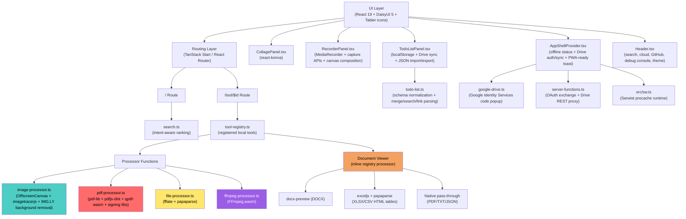
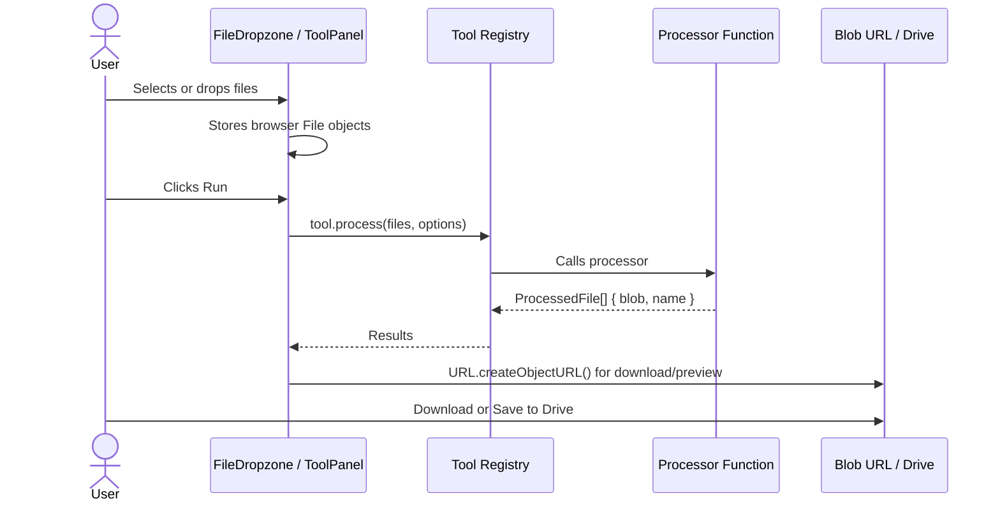
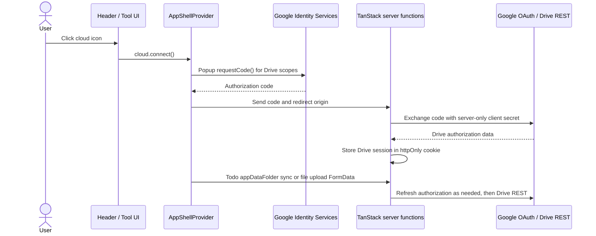

# Kitsy

Kitsy is a local-first toolbox for everyday file, media, document, recorder, and todo workflows. It runs as an offline-capable PWA, keeps file processing on the user's device, and uses a small backend session only for optional Google Drive authorization and upload proxying.

Optional Google Drive support lets users sync the todo list into their own hidden Drive app data and save processed outputs into their own Drive. The app still works local-only when Drive is disconnected, unconfigured, or unavailable.

Useful if you want an offline-friendly alternative to TinyWow, 123apps, Smallpdf, iLovePDF, and similar browser tool services.

> Please consider leaving a star.

---

## Architecture

### Component Overview


```mermaid
flowchart TD
    UI["UI Layer<br/>(React 19 + DaisyUI 5 + Tabler icons)"] --> Router["Routing Layer<br/>(TanStack Start / React Router)"]
    Router --> HomeRoute["/ Route"]
    Router --> ToolRoute["/tool/$id Route"]
    HomeRoute --> SearchRank["search.ts<br/>(intent-aware ranking)"]
    ToolRoute --> Registry["tool-registry.ts<br/>(registered local tools)"]
    Registry --> Processors["Processor Functions"]
    Processors --> ImgProc["image-processor.ts<br/>(OffscreenCanvas + imagetracerjs + IMG.LY background removal)"]
    Processors --> PdfProc["pdf-processor.ts<br/>(pdf-lib + pdfjs-dist + qpdf-wasm + signing libs)"]
    Processors --> FileProc["file-processor.ts<br/>(fflate + papaparse)"]
    Processors --> FfmpegProc["ffmpeg-processor.ts<br/>(FFmpeg.wasm)"]
    Registry --> DocInline["Document Viewer<br/>(inline registry processor)"]
    DocInline --> docxPrev["docx-preview (DOCX)"]
    DocInline --> xlsxLib["exceljs + papaparse<br/>(XLSX/CSV HTML tables)"]
    DocInline --> nativeDocs["Native pass-through<br/>(PDF/TXT/JSON)"]
    UI --> CollageUI["CollagePanel.tsx<br/>(react-konva)"]
    UI --> RecorderUI["RecorderPanel.tsx<br/>(MediaRecorder + capture APIs + canvas composition)"]
    UI --> TodoUI["TodoListPanel.tsx<br/>(localStorage + Drive sync + JSON import/export)"]
    TodoUI --> TodoModel["todo-list.ts<br/>(schema normalization + merge/search/link parsing)"]
    UI --> ShellUI["AppShellProvider.tsx<br/>(offline status + Drive auth/sync + PWA-ready toast)"]
    UI --> Header["Header.tsx<br/>(search, cloud, GitHub, debug console, theme)"]
    ShellUI --> DriveAuth["google-drive.ts<br/>(Google Identity Services code popup)"]
    ShellUI --> ServerFns["server-functions.ts<br/>(OAuth exchange + Drive REST proxy)"]
    ShellUI --> SW["src/sw.ts<br/>(Serwist precache runtime)"]

    style ImgProc fill:#4ecdc4,color:#000
    style PdfProc fill:#ff6b6b,color:#000
    style FileProc fill:#ffe66d,color:#000
    style FfmpegProc fill:#9b5de5,color:#fff
    style DocInline fill:#f4a261,color:#000
```

### Routing

- `/` renders `src/routes/index.tsx`, reads the `q` search param, ranks all registry tools with `rankToolsByQuery()`, and otherwise groups tools by category.
- `/tool/$id` renders `src/routes/tool.$id.tsx`, looks up the ID with `getToolById()`, and passes the selected tool to `ToolPanel`.
- `src/routes/__root.tsx` owns the app shell, metadata, theme bootstrap, route preloading, and route-specific PWA manifest switching. `/tool/todo-list` uses `/manifest-todo.json`; all other routes use `/manifest.json`.
- There are no per-tool route files.

---

## Tool Model

All tools are objects in `src/lib/tool-registry.ts`. A tool definition contains:

- `id`, `name`, `description`, `category`, `icon`
- `acceptedExtensions` and optional `producedExtensions`
- `multiple`
- optional `requiresFiles`
- optional `uiMode`: `standard`, `auto-process`, `collage`, `recorder`, `scanner`, or `todo`
- `options`
- `process(files, options) => Promise<ProcessedFile[]>`

`ToolPanel` handles file selection, previews, options, processing, result cards, downloads, ZIP download-all, and Drive upload actions for standard tools. Custom UI modes render:

- `auto-process`: runs immediately after file selection; currently used by `document-viewer`.
- `collage`: renders `CollagePanel`.
- `recorder`: renders `RecorderPanel`.
- `scanner`: renders `ScannerPanel` for camera/image capture into a local PDF.
- `todo`: renders `TodoListPanel`.

`batch()` in the registry sequentially applies single-file processors to multi-file tools. Tools like PDF merge and image-to-PDF handle all files as one batch.

`FileDropzone` accepts drag/drop and hidden file input selection. It builds the input `accept` string from `acceptedExtensions`, optional MIME types, and an extra `text/csv` hint for CSV selection on mobile browsers. `ToolCard` shows the first four accepted extensions visually, adds a `+N` badge for the rest, and includes an `sr-only` metadata block with the tool description and accepted extensions.

## Processing Responsibilities

### Image Processor

`src/lib/image-processor.ts` uses `OffscreenCanvas` and native image loading. SVG input is loaded through `HTMLImageElement`; other images use `createImageBitmap()`. It implements image conversion, resize, rotate, crop, upscale, blur, pixelate, draggable text-box overlays for captions and watermarks with automatic wrapping/font fitting, and raster-to-SVG tracing through `imagetracerjs`.

AI background removal uses `@imgly/background-removal` with the `isnet_quint8` model and local `@imgly/background-removal-data` assets served from `/background-removal/`. The tool outputs transparent PNGs by default and can composite the cutout over a selected background color.

### PDF Processor

`src/lib/pdf-processor.ts` uses:

- `pdf-lib` for structural edits, page operations, interleaving/splitting/mirroring, page numbers, text overlays, watermarks, metadata, signatures-as-stamps, image-to-PDF, flattening, annotation removal, and CSV dimension reports.
- `pdfjs-dist` through `src/lib/pdfjs.ts` for rendering PDF pages to images/previews, text extraction/comparison, and bookmark-aware splitting.
- `@neslinesli93/qpdf-wasm` for password lock/unlock.
- `zgapdfsigner` for certificate-based signing.
- `node-forge` for signature validation support.

PDF byte output is wrapped through helpers that avoid TS6 `Uint8Array<ArrayBufferLike>` `BlobPart` issues by copying/slicing data first.

PDF text extraction and comparison use the document text layer only; scanned PDFs without selectable text are not OCR’d. PDF text additions are overlays, not edits to arbitrary existing PDF glyphs. The app intentionally does not offer PDF/Office format conversion, OCR, AI, or repair claims because those operations cannot reliably preserve the expected source structure in this local stack.

### FFmpeg Processor

`src/lib/ffmpeg-processor.ts` lazy-loads a singleton `FFmpeg` instance from `/ffmpeg/ffmpeg-core.js` and `/ffmpeg/ffmpeg-core.wasm`. `prefetchFFmpeg()` is called by the app shell so the offline cache is warmed early. Each operation writes browser `File` data into FFmpeg's virtual filesystem, runs `ff.exec([...])`, reads output, copies bytes into a clean `Uint8Array`, creates a `Blob`, and deletes temporary VFS files.

Supported operations include video/audio conversion, trimming, extracting audio, merging video/audio, muting, speed changes, resizing, cropping, video watermarking through a generated PNG overlay, frame extraction, volume changes, and audio fades.

### File and Data Processor

`src/lib/file-processor.ts` uses `fflate` for ZIP creation/extraction and `papaparse` for CSV/JSON conversion. JSON formatting uses native `JSON.parse()` and `JSON.stringify()`.

### Document Viewer

`document-viewer` is implemented inline in `tool-registry.ts` and auto-processes after file drop:

- PDF, TXT, and JSON pass through as the original file.
- DOCX passes through and renders with `docx-preview` in `DocxPreview`.
- XLSX loads the first worksheet with `exceljs` and renders an HTML table.
- CSV parses with `papaparse` and renders an HTML table.

HTML/PDF previews render in iframes; DOCX and text/JSON render inline.

### Collage

`src/components/CollagePanel.tsx` uses `react-konva` on an 800x600 canvas. Users can drag, transform, reorder selected images, and export PNG or JPG directly from the Konva stage.

### Recorder

`src/components/RecorderPanel.tsx` uses browser capture APIs and `MediaRecorder`:

- Screen recorder uses `getDisplayMedia()`, optional camera overlay from `getUserMedia()`, optional microphone/system audio mixing, canvas composition at 30 FPS, and a draggable/resizable overlay rectangle.
- Camera recorder uses `getUserMedia()` with optional microphone.
- Audio recorder uses microphone-only `getUserMedia()`.

Output names are generated by `src/lib/recorder.ts` and use WebM or Ogg depending on supported MIME type. Screen recording is gated to desktop-sized viewports (`>= 768px`).

### Scanner

`src/components/ScannerPanel.tsx` captures camera stills with `getUserMedia()` or accepts local image files, presents a thumbnail for each page, and lets users reorder or straighten individual pages before handing them to the existing `imagesToPdf()` processor. Users position four document corners; a local canvas perspective transform flattens that quadrilateral into a rectangular page and replaces only the selected page. It provides an upload fallback when camera access is unavailable; it does not perform OCR or automatic document detection.

### Todo List

`src/components/TodoListPanel.tsx` and `src/lib/todo-list.ts` implement a local-first todo list:

- Primary local key: `kitsy.todo-list.v1`.
- Blank draft row at the top.
- Inline `contenteditable` plain-text editing; paste is forced to `text/plain`.
- Clickable `http`/`https` links are rendered outside edit mode with `target="_blank"` and `noopener`.
- Search supports token and subsequence matching.
- Filters: open, done, all.
- Reminders are stored as `YYYY-MM-DD` and "today" compares month/day in UTC.
- Pinned items sort first.
- Deletes are soft deletes (`deletedAt`) so Drive merge can resolve them.
- Import/export uses JSON arrays. Sync uses a versioned `{ version: 2, syncedAt, items }` document.
- Merge resolution prefers the item with the newest `deletedAt`, `updatedAt`, or `createdAt`, then additional stable tie breakers.

---

## Data Flow

### Standard File Tool


```mermaid
sequenceDiagram
    actor User
    participant Drop as FileDropzone / ToolPanel
    participant Reg as Tool Registry
    participant Proc as Processor Function
    participant Blob as Blob URL / Drive

    User->>Drop: Selects or drops files
    Drop->>Drop: Stores browser File objects
    User->>Drop: Clicks Run
    Drop->>Reg: tool.process(files, options)
    Reg->>Proc: Calls processor
    Proc-->>Reg: ProcessedFile[] { blob, name }
    Reg-->>Drop: Results
    Drop->>Blob: URL.createObjectURL() for download/preview
    User->>Blob: Download or Save to Drive
```

### Google Drive Auth and Sync


```mermaid
sequenceDiagram
    actor User
    participant Header as Header / Tool UI
    participant Shell as AppShellProvider
    participant GIS as Google Identity Services
    participant Server as TanStack server functions
    participant Google as Google OAuth / Drive REST

    User->>Header: Click cloud icon
    Header->>Shell: cloud.connect()
    Shell->>GIS: Popup requestCode() for Drive scopes
    GIS-->>Shell: Authorization code
    Shell->>Server: Send code and redirect origin
    Server->>Google: Exchange code with server-only client secret
    Google-->>Server: Drive authorization data
    Server->>Server: Store Drive session in httpOnly cookie
    Shell->>Server: Todo appDataFolder sync or file upload FormData
    Server->>Google: Refresh authorization as needed, then Drive REST
```

Drive constants:

- Reconnect hint: `kitsy.google-drive.connected`
- Todo Drive file: `kitsy.todo-sync.v2.json` in `appDataFolder`
- Result folder: visible `Kitsy` folder in the user's Drive
- Scopes: `drive.appdata` and `drive.file`
- Session cookie: `kitsy_session` in development and `__Host-kitsy_session` in production
- Uploads proxy through the Kitsy server as multipart Drive uploads.
- Disconnect clears the server session and best-effort revokes the Drive grant.

---

## PWA and Offline Support

Serwist is configured in `vite.config.ts` and the runtime service worker lives in `src/sw.ts`.

The production build precaches `.output/public` plus additional entries:

- `/`
- `/ffmpeg/ffmpeg-core.js`
- `/ffmpeg/ffmpeg-core.wasm`
- `/qpdf.wasm`
- `/background-removal/` model and ONNX Runtime chunks generated during `postinstall`

The FFmpeg, qpdf, and IMG.LY background-removal assets are copied into `public/` by `scripts/stage-wasm-assets.ts` during `postinstall`. The background-removal data package is installed from the versioned IMG.LY data tarball and staged locally so runtime inference does not depend on a CDN. Revisions include the installed package versions. The maximum precache file size is `160 * 1024 * 1024` bytes.

`AppShellProvider` registers `/sw.js`, prefetches FFmpeg, and shows an offline-ready toast once both service worker readiness and FFmpeg prefetch complete. qpdf is precached by the service worker but initialized lazily by matching PDF tools.

---

## Search

`src/lib/search.ts` ranks tools from the static registry. It supports:

- Exact name and ID matches.
- Name, ID, description, category, keyword, accepted extension, and produced extension matching.
- Conversion intent such as `jpg to png`.
- Synonyms: `shrink`, `combine`, `join`, `record`, `checklist`, `photo`, and `sound`.
- Format aliases: `jpeg -> jpg`, `tif -> tiff`, `text -> txt`, `yml -> yaml`.

Search results are exposed on the homepage through the `q` query param.

---

## Google Drive Setup

Kitsy uses Google Identity Services in the browser only to obtain an authorization code. The backend exchanges that code with the server-only OAuth client secret, stores the Drive session in an httpOnly cookie, and proxies Drive REST calls.

1. Open Google Cloud Console and create or select a project.
2. Enable the Google Drive API.
3. Configure the OAuth consent screen in Google Auth Platform. Set app name, support email, developer contact, and production links as needed.
4. In Data Access, request:
   - `https://www.googleapis.com/auth/drive.appdata`
   - `https://www.googleapis.com/auth/drive.file`
5. Create an OAuth Client ID with application type `Web application`.
6. Add Authorized JavaScript origins, for example:
   - `http://localhost:3000`
   - `https://your-production-domain.example`
7. Add Authorized redirect URIs matching the origins, for example:
   - `http://localhost:3000`
   - `https://your-production-domain.example`
8. Set local env vars:
   - `GOOGLE_DRIVE_CLIENT_ID=...`
   - `GOOGLE_DRIVE_CLIENT_SECRET=...`
   - Do not use Vite's public client-env prefix for these values.
9. Start the app, click the cloud icon, grant access, and verify the icon changes to connected.

---

## Security and Privacy

- Files are processed locally in the browser.
- Google Drive is optional and disabled when offline or when `GOOGLE_DRIVE_CLIENT_ID` or `GOOGLE_DRIVE_CLIENT_SECRET` is missing.
- OAuth credentials and Drive authorization data stay on the server side. Browser storage only keeps a non-secret reconnect hint.
- Todo sync writes one JSON document into Drive `appDataFolder`.
- Processed output uploads occur only when the user clicks a Drive save action and are proxied through same-origin server functions.
- DOCX rendering is delegated to `docx-preview`; error messages are inserted with `textContent`.
- Todo editing uses plain-text contenteditable handling and React-rendered URL anchors.
- DebugConsole intentionally monkey-patches console methods in the browser to show client logs from the header.

---

## Limitations

- Large files may hit browser memory limits; there is no streaming-to-disk pipeline.
- WASM codec support depends on the bundled FFmpeg core.
- Some FFmpeg operations may fail for codecs/containers unsupported by the browser-side build.
- Safari support may vary for WASM, capture APIs, and MediaRecorder MIME types.
- Browser storage can be cleared by the user, browser policy, private browsing, or storage pressure.
- Drive todo sync is timestamp-based item merge, not real-time collaboration and not conflict UI.
- Google OAuth misconfiguration must be fixed in Google Cloud Console; Kitsy cannot repair it from the browser.

---

## Development

### Environment

Use `nix develop` for Node 24 and npm:

```sh
nix develop
```

The shell hook runs `npm install`, prints `node -v` and `npm -v`, and enters `zsh`. `postinstall` stages FFmpeg, qpdf, and background-removal WASM/model assets.

Common commands:

```sh
nix develop -c npm run dev
nix develop -c npm run build
nix develop -c npm run preview
nix develop -c npm run test
nix develop -c npm run test:e2e
nix develop -c npm run check
nix develop -c npm run format
```

Scripts:

- `dev`: loads `.env`, imports `instrument.server.mjs`, and starts Vite dev on port 3000.
- `build`: runs `vite build` and copies Sentry server instrumentation into `.output/server` when present.
- `preview`: runs Vite preview on port 3000.
- `start`: starts the Nitro server output with instrumentation.
- `test`: Vitest.
- `test:e2e`: Playwright.
- `showcase:concat`: concatenates successful E2E recordings.
- `check`, `lint`, `format`: Biome.

### Rules for Changes

- Update this README with every behavior, architecture, tooling, or tool-registry change.
- Test browser behavior against the production build (`npm run build` plus preview), because service worker behavior differs from dev.
- Keep tools in `tool-registry.ts`; do not add per-tool routes.
- Keep processors stateless and browser-side in `src/lib/*-processor.ts`.
- Keep file data as native `File` or `Blob` until a library requires `ArrayBuffer`.
- Keep backend behavior scoped to Google Drive authorization, todo sync, and upload proxying.
- Do not add custom service worker logic beyond Serwist configuration and `src/sw.ts`.
- UI should use DaisyUI component classes. `src/styles.css` is the Tailwind/DaisyUI setup file, not a place for feature-specific CSS.
- Biome uses tabs, double quotes, and no semicolons.
- React Compiler is enabled in `@vitejs/plugin-react`; avoid manual `useMemo`/`useCallback` unless required for behavior.

### Adding a Tool

1. Add or reuse a processor in the appropriate `src/lib/*-processor.ts` file.
2. Add one object to the `tools` array in `src/lib/tool-registry.ts`.
3. Set `acceptedExtensions` to strings beginning with `.` or the wildcard `*`.
4. Add focused processor tests or E2E showcase coverage.
5. Update this README, especially the tool list and processor responsibilities.

### Common Pitfalls

- `Uint8Array<ArrayBufferLike>` is not a TS6-safe `BlobPart`; copy/slice before `new Blob()`.
- FFmpeg and Drive OAuth should be checked against both dev and production preview.
- `acceptedExtensions` is extension-oriented. MIME handling belongs in file input accept logic or option `accept` fields.
- `document-viewer` auto-runs after file selection and does not show a Run button.
- qpdf and FFmpeg assets must be present in `public/` after install/build staging.

---

## Tests and Showcase

Vitest covers processors, search, registry behavior, recorder helpers, and selected components.

Playwright (`tests/e2e/showcase.spec.ts`) runs the `sparticuz-chromium` project against `npm run build && npm run preview` on port 3000 by default, or `PLAYWRIGHT_PORT` when set. It generates sample assets with `download-samples.ts`, drives supported tools, records videos, and writes `SUCCESS` markers for passing cases. `concat-videos.ts` combines successful recordings into `videos/full-showcase.webm`.

Current E2E coverage includes most registered tools. Certificate signing, signature validation, and unlock flows are intentionally covered by focused processor tests where browser fixture setup is less practical.

Stable test IDs:

- `file-input`
- `run-button`
- `result-card`
- `result-save-to-drive`
- `result-save-all-to-drive`
- `preview`
- `crop-selection`
- `crop-resize-handle`
- `camera-overlay`
- `camera-overlay-handle`
- `recorder-toggle`
- `recorder-mounted`
- `todo-input`
- `todo-draft-input`
- `todo-edit-input`
- `todo-import`
- `todo-export`
- `todo-item`
- `todo-link`
- `todo-mounted`

---

## ToDo

- [ ] Add a chatbox (DaisyUI chat component) that is available when online, allowing users to send tasks and attachments.
- [ ] Have the autonomous LLM complete tasks and return output using frontend tools/functions.
- [ ] Support chat history through the AI provider's API.
- [ ] Allow the AI to execute tools autonomously without requiring the user to click Run or explicitly confirm actions.
- [ ] Provide tool access dynamically using structured Function Calling, not prompt engineering. Function schemas should be generated dynamically from `tool-registry.ts`.
- [ ] Ensure the AI can handle normal conversation context even when the prompt does not explicitly mention file operations.
- [ ] Allow the AI to extract file metadata dynamically, such as size and resolution, when needed for an operation.
- [ ] For region-based tools like cropping, pixelating, or collages, route the user to the tool UI with the file preloaded and the relevant docs attached.
- [ ] If a file is uploaded first and a prompt is entered later, the AI should use the previous context to continue the task.
